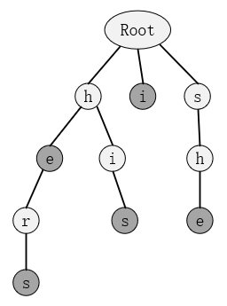
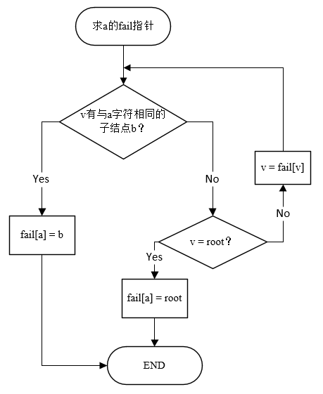
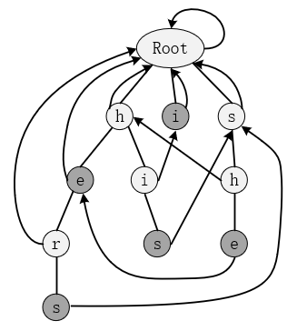

## 第四章 AC自动机

​	AC自动机（Aho-Corasick automaton），1975年诞生于贝尔实验室，是由Alfred V. Aho和Margaret J.Corasick发明的一种多模匹配算法，用于在一个文本串中匹配多个模式串。AC自动机可以同时与所有模式串进行匹配并且在扫描文本串时不需要回溯，在均摊情况下具有近似于线性的时间复杂度，与文本串长度、总的模式串长度以及输出匹配的数量有关。但是由于需要找到所有的匹配情况，如果每个模式串互相匹配（如模式串为a，aa，aaa，aaaa，文本串为aaaaaaa），那么算法的时间复杂度会近似于匹配数量的二次方 。

​	AC自动机主要有三个步骤，一是字典树的构造，二是fail指针的构建，三是字符串的匹配。其思想是利用多个模式串建立出一个字典树，然后利用类似于KMP算法的思想对字典树上所有的结点构造fail指针，这些fail指针用于。为了能够更快地理解AC自动机，在学习之前，最好先了解一下KMP算法和字典树，这两部分在前面已经讲过。

##### 4.1 字典树构造

​	用所有模式串构造一棵字典树，构建方法与上一章讲的一样。若有模式串集合{i, he, his, she, hers}，则构建字典树如下：



##### 4.2 失配（fail）指针构建

##### 4.2.1 初步了解fail指针

​	AC自动机里的fail指针与在KMP算法中讲过的next指针类似，都是在匹配失败的情况下用于模式串跳转的指针。在KMP算法中是一个模式串匹配一个文本串，而AC自动机需要多个模式串来匹配一个文本串，因此AC自动机的fail指针表示的不再是最长相同前后缀。假设某一结点a所表示的字符串为“abcde”，那此字符串有后缀集合{bcde,cde,de,e}，在这棵字典树中，有可能存在某些结点恰好表示的是后缀集合中的某个字符串，那么a的fail指针指向的就是这些结点中表示最长字符串的结点。

​	求fail指针的过程其实是一个BFS，用部分已经求出fail指针的结点推导出当前结点的fail指针。假设我们现在要求的是结点a，其父节点是u，因为是BFS，所以深度小于a的结点的fail指针显然已经求得，也就是说fail[u]已知，假设为v。则求fail[a]的过程可以用流程图表示：


​	对4.1中的字典树，我们可以建立出如下：


##### 4.4.2 构建fail指针的代码实现

​	首先给出AC自动机的存储结构： 

```c++
struct AC_automaton {
	int tr[maxn][26], cnt;//Trie结构，假设都是小写英文字母
	int end[maxn];//判断此节点是不是结尾
	int fail[maxn];//fail指针

	void insert(char * s) {}//插入模式串
	void build() {}//构建fail指针
	int query(char *t) {}//匹配函数
};
AC_automaton ac;
```

​	下面是build()实现：

```c++
void AC_automaton::build() {
	queue<int> q;
	memset(fail, 0, sizeof(fail));
	for (int i = 0; i < 26; i++) {
		if (tr[0][i] != 0) q.push(tr[0][i]);//根节点孩子的fail是根节点
	}
	while (!q.empty()) {
		int k = q.front(); q.pop();
		for (int i = 0; i < 26; i++) {
			if (tr[k][i] != 0) {
				fail[tr[k][i]] = tr[fail[k]][i];//*
				q.push(tr[k][i]);
			}
			else tr[k][i] = tr[fail[k]][i];//#
		}
	}
}
```

​	可以发现，代码实现和流程图其实是有一点区别的，按照流程图中的表示，在代码“*”标记处应该是一个while循环，不断地跳转fail指针直到找到合适的结点；同样，“#”标记处在流程图中也没有对应。 

​	其实，按照流程图中的实现出来也没有问题，而标记的两处代码实际上是起到了“路径压缩”的作用，有点类似于并查集中的路径压缩，将前面那个例子手动模拟一下就很好理解了。有了这个步骤，对单个结点构建fail指针的时间复杂度从之前的和深度有关下降到了$O(1)$。

##### 4.3 字符串的多模式匹配

​	匹配这一部分需要具体问题具体分析，没有固定的代码。下面给出一个例子，用AC自动机判断一个文本串中出现了几个模式串集中的字符串。假设文本串为“shers”，模式串集与4.1种的相同。代码如下：

```c++
int AC_automaton::query(char *t) { 
	int len = strlen(t), pos = 0, res = 0;
	for (int i = 0; i < len; i++) {
		pos = tr[pos][t[i] - 'a'];
		int tmp = pos;
		while (tmp != 0) {
			res += end[tmp];
			end[tmp] = 0;
			tmp = fail[tmp];
		}
	}
	return res;
}
```

​	代码很好理解，对于文本串中的每一个位置，都判断是不是作为结尾来匹配某些模式串，while语句正是利用fail指针的连续跳转实现了同时匹配多个模式串的目的，end[tmp]=0是为了防止一个模式串会被多次匹配。 

##### 4.4 例题分析

###### 4.4.1 寻找模式串

###### 题目描述（空间限制：131072KB 时间限制：1000MS）

​	判断一个文本串中出现了几个模式串集中的字符串

###### 输入格式

​	第一行输入数据组数N

​	下面输入N组数据，每一组第一行为一个整数n，表示模式串数量，接下来n行为n个模式串，第n+1行为文本串

###### 输出格式

 	N行，每行对应每组数据的答案

###### 输入样例

​	1
​	5
​	she
​	he
​	say
​	shr
​	her
​	yasherhs

###### 输出样例

​	 3


###### 代码

```c++
#include<iostream>
#include<cstring>
#include<string>
#include<string.h>
#include<queue>
using namespace std;
const int maxn = 500010;
struct AC_automaton {
	int tr[maxn][26], cnt; 
	int end[maxn]; 
	int fail[maxn];

	void insert(char * s);
	void build();
	int query(char *t);
};
AC_automaton ac;

void AC_automaton::insert(char *s) {
	int pos = 0, len = strlen(s);
	for (int i = 0; i < len; i++) {
		int k = s[i] - 'a';
		if (tr[pos][k] == 0) {
			tr[pos][k] = ++cnt;
			for (int j = 0; j < 26; j++) tr[cnt][j] = 0;
			end[cnt] = 0;
			fail[cnt] = 0;
		}
		pos = tr[pos][k];
	}
	end[pos]++;
}
void AC_automaton::build() {
	queue<int> q;
	memset(fail, 0, sizeof(fail));
	for (int i = 0; i < 26; i++) {
		if (tr[0][i] != 0) q.push(tr[0][i]); 
	}
	while (!q.empty()) {
		int k = q.front(); q.pop();
		for (int i = 0; i < 26; i++) {
			if (tr[k][i] != 0) {
				fail[tr[k][i]] = tr[fail[k]][i];
				q.push(tr[k][i]);
			}
			else tr[k][i] = tr[fail[k]][i];
		}
	}
}
int AC_automaton::query(char *t) { 
	int len = strlen(t), pos = 0, res = 0;
	for (int i = 0; i < len; i++) {
		pos = tr[pos][t[i] - 'a'];
		int tmp = pos;
		while (tmp != 0) {
			res += end[tmp];
			end[tmp] = 0;//
			tmp = fail[tmp];
		}
	}
	return res;
}

int N, n;
char s[1000010];
int main() {
	scanf("%d", &N);
	while (N--) {
		ac.cnt = 0;
		for (int i = 0; i < 26; i++) ac.tr[0][i] = 0;
		ac.end[0] = 0;
		ac.fail[0] = 0;

		scanf("%d", &n);
		for (int i = 0; i < n; i++) {
			scanf("%s", s);
			ac.insert(s);
		}
		ac.build();
		scanf("%s", s);
		printf("%d\n", ac.query(s));
	}
	
	system("pause");
	return 0;
}
```

##### 4.4.1 病毒侵袭

###### 题目描述（空间限制：131072KB 时间限制：1000MS）

​	当太阳的光辉逐渐被月亮遮蔽，世界失去了光明，大地迎来最黑暗的时刻。。。。在这样的时刻，人们却异常兴奋——我们能在有生之年看到500年一遇的世界奇观，那是多么幸福的事儿啊~~

​	但网路上总有那么些网站，开始借着民众的好奇心，打着介绍日食的旗号，大肆传播病毒。小t不幸成为受害者之一。小t如此生气，他决定要把世界上所有带病毒的网站都找出来。当然，谁都知道这是不可能的。小t却执意要完成这不能的任务，他说：“子子孙孙无穷匮也！”（愚公后继有人了）。

​	万事开头难，小t收集了好多病毒的特征码，又收集了一批诡异网站的源码，他想知道这些网站中哪些是有病毒的，又是带了怎样的病毒呢？顺便还想知道他到底收集了多少带病毒的网站。这时候他却不知道何从下手了。所以想请大家帮帮忙。小t又是个急性子哦，所以解决问题越快越好哦~~

###### 输入格式

​	第一行，一个整数N（1<=N<=500），表示病毒特征码的个数。

​	接下来N行，每行表示一个病毒特征码，特征码字符串长度在20—200之间。

​	每个病毒都有一个编号，依此为1—N。

​	不同编号的病毒特征码不会相同。

​	在这之后一行，有一个整数M（1<=M<=1000），表示网站数。

​	接下来M行，每行表示一个网站源码，源码字符串长度在7000—10000之间。

​	每个网站都有一个编号，依此为1—M。

​	以上字符串中字符都是ASCII码可见字符（不包括回车）。

###### 输出格式

​	依次按如下格式输出按网站编号从小到大输出，带病毒的网站编号和包含病毒编号，每行一个含毒网站信息。

​	web 网站编号: 病毒编号 病毒编号 …

​	冒号后有一个空格，病毒编号按从小到大排列，两个病毒编号之间用一个空格隔开，如果一个网站包含病毒，病毒数不会超过3个。

​	最后一行输出统计信息，如下格式

​	total: 带病毒网站数

​	冒号后有一个空格。

###### 输入样例

​	3
​	aaa
​	bbb
​	ccc
​	2
	aaabbbccc
​	bbaacc

###### 输出样例

​	web 1: 1 2 3 
	total: 1


###### 题解

​	裸的AC自动机，注意病毒特征码和网站源码不只有小写字母，还有输出的时候要注意格式，具体看代码。 

###### 代码

```c++
#include<iostream>
#include<cstdio>
#include<cstring>
#include<queue>
#include<algorithm>
#include<cmath>
using namespace std;
typedef long long LL;
const int maxn = 100010;
char buf[maxn];
int N, M, cnttot;
int ans[maxn], cntweb;
struct Tire {
	int next[maxn][130], end[maxn];
	vector<int> kin[maxn];
	int fail[maxn], root, tot;
	int newnode() {
		for (int i = 0; i < 128; i++) next[tot][i] = -1;
		end[tot++] = 0;
		return tot - 1;
	}
	void init() {
		tot = 0;
		root = newnode();
	}
	void insert(char buf[], int k) {//把第 k种类型的病毒信息放在字典树中 
		int len = strlen(buf);
		int now = root;
		for (int i = 0; i < len; i++) {
			if (next[now][buf[i]] == -1) next[now][buf[i]] = newnode();
			now = next[now][buf[i]];
		}
		end[now]++; kin[now].push_back(k);
	}
	void build() {
		queue<int> Q;
		fail[root] = root;
		for (int i = 0; i < 128; i++) {
			if (next[root][i] == -1) next[root][i] = root;
			else {
				fail[next[root][i]] = root;
				Q.push(next[root][i]);
			}
		}
		while (!Q.empty()) {
			int now = Q.front(); Q.pop();
			for (int i = 0; i < 128; i++) {
				if (next[now][i] == -1) next[now][i] = next[fail[now]][i];
				else {
					fail[next[now][i]] = next[fail[now]][i];
					Q.push(next[now][i]);
				}
			}
		}
	}
	bool used[maxn];
	void query(char buf[], int num) {
		int len = strlen(buf), now = root;
		memset(used, false, sizeof(used));
		for (int i = 0; i < len; i++) {
			now = next[now][buf[i]];
			int tmp = now;
			while (tmp != root) {
				if (end[tmp] != 0) {
					for (int j = 0; j < kin[tmp].size(); j++) {
						int y = kin[tmp][j];
						if (used[y] == false) {
							ans[++cntweb] = y;
							used[y] = true;
						}
					}
				}
				tmp = fail[tmp];
			}
		}
		if (cntweb != 0) {
			cnttot++;
			sort(ans + 1, ans + cntweb + 1);
			printf("web %d:", num);
			for (int i = 1; i <= cntweb; i++) printf(" %d", ans[i]);
			printf("\n");
			memset(ans, 0, sizeof(ans)); cntweb = 0;
		}
	}
}ac;
int main() {
	scanf("%d", &N);
	ac.init();
	for (int i = 1; i <= N; i++) {
		scanf("%s", buf);
		ac.insert(buf, i);
	}
	ac.build();
	scanf("%d", &M);
	for (int i = 1; i <= M; i++) {
		scanf("%s", buf);
		ac.query(buf, i);
	}
	printf("total: %d\n", cnttot);
	return 0;
}
```

