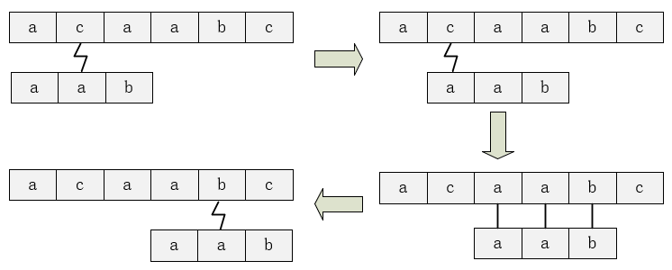
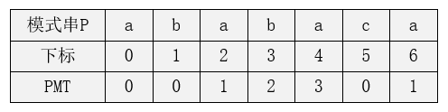
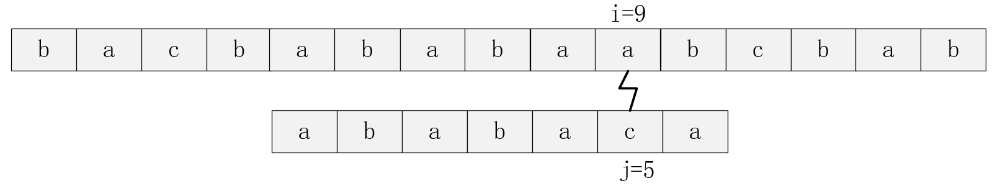
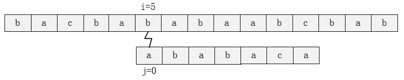
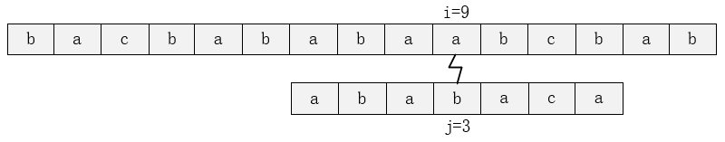
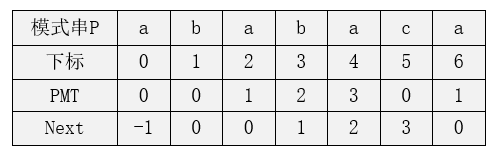
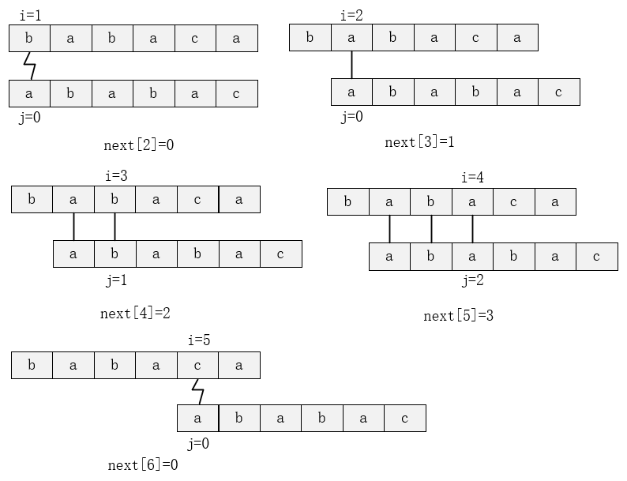

## 第二章 KMP算法

​	KMP算法，是1977年由D.E.Knuth、J.H.Morris和V.R.Pratt三人联合提出的一种线性时间字符串匹配算法。与朴素字符串匹配算法不同的是，KMP算法通过利用模式串P本身的字符信息和匹配失败后的信息，确定下一次匹配的起始位置，从而避免重新检查先前已经匹配过的字符，这样做的好处是减少了一些无意义的匹配次数，将时间复杂度控制在了$O(n+m)$，其中n是文本串T的长度，m是模式串P的长度。

​	虽然KMP算法是针对字符串匹配问题提出的，但在实际的OI做题中未必就局限于文本的匹配，有的题目会通过巧妙地利用KMP算法中的next数组或者其思想来解决一些问题。此外，关于KMP算法的讲解和实现方法很多，建议多看几种讲解思路以加深理解，选取自己喜欢的实现方式记忆下来。

##### 2.1 朴素字符串匹配算法

​	在学习KMP算法之前，再来提一下朴素的字符串匹配算法，方便比较两者之间的差别，以加深对这类问题的理解。设有文本串$T=acaabc$和模式串$P=aab$，我们可以把朴素字符串匹配过程形象地看成模式串P沿着文本串T从左向右一格一格地滑动。

​	第一次匹配，在文本串下标为2的“c”处匹配失败，模式串向右滑动一格；接着模式串从头开始进行第二次匹配，在文本串下标为2的“c”处匹配失败，模式串向右滑动一格；模式串再次从头开始第三次匹配，这次发现匹配成功，匹配成功后的模式串向右滑动一格，继续查找还有没有匹配的情况；第四次匹配在文本串下标为5的“b”处匹配失败，发现模式串已经不能移动了，算法结束。整个过程如下图：


​	在最坏的情况下，朴素字符串匹配算法的时间复杂度为$O((n-m+1)m)$，如文本串$T=aaaaaaaaaa$，$P=aaaaa$。所以，朴素字符串匹配算法的复杂度可以看作是二次方级别的，这是一种比较低效的算法。 

##### 2.2 KMP算法

##### 2.2.1 PMT数组

​	PMT数组，全称叫做Partial Match Table数组，可以翻译成“部分匹配表”数组，它只和模式串P有关，是KMP算法的核心，理解了PMT数组也就理解了KMP算法。通过2.1的讲解，我们可以发现朴素算法的特点是模式串沿着文本串“一格一格”地移动，而KMP算法就会利用这个PMT数组来“跳跃” 地移动。假设有模式串$P=ababaca$，其PMT数组如下：


​	要想理解PMT数组首先要明白什么是字符串的前缀和后缀，对模式串$P=ababaca$来说，其前缀集合是：{a, ab, aba, abab, ababa, ababac}，后缀集合是：{babaca, abaca, baca, aca, ca, a}。也就是说，如果有三个非空字符串A、B、C，若A=BC，则B就是A的一个前缀；同理，若A=CB，则B就是A的一个后缀。可以发现，在这里字符串本身并不是自己的前后缀。 

​	对模式串$P=p_0p_1…p_{m-1}$，我们定义其PMT[j]的值为字符串$P_j=p_0p_1…p_j$的前缀集合与后缀集合的交集中最长元素的长度。以PMT[4]为例，$P_4=p_0p_1p_2p_3p_4=ababa$，其前缀集合为{a, ab, aba, abab}，后缀集合为{baba,aba,ba,a}，前缀集合与后缀集合的交集为{a,aba}，其中最长的元素为aba，长度为3，所以PMT[4]=3。

##### 2.2.2 KMP算法匹配过程与next数组

​	现在已经对PMT数组有了一个初步的了解，下面将通过一个例子来讲解KMP算法的匹配过程并引出next数组。假设有文本串$T=bacbababaabcbab$和2.2.2中的模式串$P=ababaca$，匹配到如下图所示位置：


​	可以看出，模式串在j=5的“c”处匹配失败。若为朴素匹配算法，模式串将会向右移动一格，然后令j=0，i=5重新匹配，也就是下图：


​	但从2.2.2中的分析我们可以看出，“ababa”有着相同的前缀和后缀“aba”，有了这个条件我们可以直接令j=next[5-1]=3，i=9保持不动，也就是相当于模式串向右移动了两格并且省去了一些匹配次数，如下图：


其正确性显而易见，模式串的前三位可以保证是匹配的。 

​	由此，我们总结出一条规律，当文本串在位置i，模式串在位置j时匹配失败，则i保持不动，令j=PMT[j-1]。为了编程方便，我们把PMT数组向右移动一位，也就是next数组，next数组和PMT数组没有本质的区别，只是编程习惯的原因，通常next[0]会设成-1。如下图：


有了next数组，当文本串在位置i，模式串在位置j时匹配失败，就可以直接让i保持不动，j=next[j]。

##### 2.2.3 KMP算法的时间复杂度分析

​	如果在文本串位置i，模式串位置j处匹配成功，那么i和j都往后推进一格；如果匹配失败，那么i不变，j往前回溯。整个过程中i是不减小的，因此匹配过程时间复杂度为$O(n)$。 

​	计算next数组的过程其实就是字符串匹配过程，所以复杂度为$O(m)$。

​	综合来看，KMP算法总的时间复杂度为$O(n+m)$。

##### 2.3 KMP算法代码实现 

##### 2.3.1 KMP算法代码

```c++
int KMP(){//返回第一次匹配的起始位置
	int i = 0, j = 0;
	int len_T = strlen(T), len_P = strlen(P);

	while (i < len_T && j < len_P) {
		if (j == -1 || T[i] == P[j]){
			i++;
			j++;
		}
		else j = Next[j];
	}

	if (j == len_P) return i - j; 
	else return -1;//表示没有匹配的情况
}
```

​	KMP算法的匹配流程很好理解，没有什么需要解释的地方。

##### 2.3.2 求next数组代码

```c++
void getNext() {
	int i = 0, j = -1;
	int len_P = strlen(P);

	Next[0] = -1;
	while (i < len_P - 1) {
		if (j == -1 || P[i] == P[j]){
			i++;
			j++;
			Next[i] = j;
		}
		else j = Next[j];
	}
}
```

​	通过之前的讲解我们知道，PMT数组的含义是字符串的前缀集合与后缀集合的交集中最长元素的长度；next数组则是PMT数组右移一位。那么就可以利用模式串P的最长前缀与最长后缀的匹配过程来计算next值，所以上面的代码和KMP算法代码相似，其中next[0]=-1和next[1]=0是确定的。 

​	为了帮助理解，下面给出部分匹配图，在位置i，能够匹配的最长长度就是位置i+1的next值。



##### 2.4 例题分析

###### 题目描述（内存限制：65536K 时间限制：1000MS）

​	给N组数据，每组两个字符串，问第一个字符串在第二个字符串中出现的次数。

###### 输入格式

​	第一行一个整数N，表示问题组数
​	剩下输入N组数据，每一组为两个字符串

###### 输出格式

​	N行，分别为每一组数据中第一个字符串在第二个字符串中出现的次数

###### 输入样例

​	3
​	BAPC
​	BAPC
​	AZA
​	AZAZAZA
​	VERDI
​	AVERDXIVYERDIAN

###### 输出样例

​	1
​	3
​	0

###### 数据范围

​	第一个字符串长度小于10,000
​	第二个字符串长度小于1,000,000，大于10,000

###### 题解

​	对2.3中代码稍加改动。在getNext()中，原来的next算到len_P-1位，现在多算一位到len_P位；在KMP()中，如果j==len_P-1，就让j=next[len_P]。

###### 代码

```c++
#include<iostream>
#include<cstring>
#include<string>
#include<string.h>
using namespace std;
char T[1000010], P[1000010];
int Next[1000010];
int len_T, len_P, N, ANS;
void KMP(){
	int i = 0, j = 0;

	while (i < len_T) {
		if (j == -1 || T[i] == P[j]){
			if (j == len_P - 1) {
				ANS++;
				i++;
				j = Next[j + 1];
			}
			else {
				i++;
				j++;
			}
		}
		else j = Next[j];
	}

}
void getNext() {
	int i = 0, j = -1;
	
	Next[0] = -1;
	while (i < len_P) {
		if (j == -1 || P[i] == P[j]){
			i++;
			j++;
			Next[i] = j;
		}
		else j = Next[j];
	}
}

int main() {
	cin >> N;
	while (N--) {
		ANS = 0;
		cin >> P >> T;
		len_T = strlen(T); len_P = strlen(P);
		getNext();
		KMP();
		cout << ANS << endl;
	}
	return 0;
}
```

