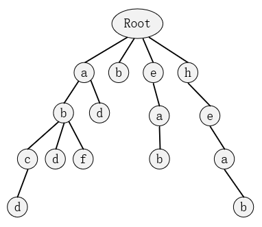
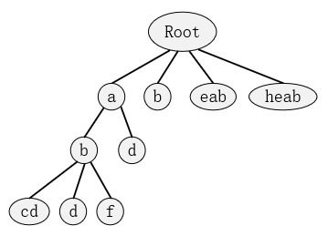

## 第三章 字典树

​	字典树，又称单词查找树、前缀树、键树或者Trie树，由Edward Fredkin发明，是一种树形结构，也是哈希树的一个变种。字典树是一种有序树，用于保存关联数组，其中的键通常是字符串。与二叉查找树不同，键不是直接保存在结点中，而是由结点在树中的位置决定。一个结点的所有子代都有相同的前缀，也就是这个结点对应的字符串，而根结点对应空字符串。一般情况下，不是所有的结点都有对应的值，只有叶子结点和部分内部结点所对应的键才有相关的值。

​	字典树可以应用在很多字符串问题中，比如存储字典、字符串的快速检索、求最长公共前缀、词频统计、字符串排序等 。

##### 3.1 标准字典树（Standard Trie）

​	下图为一个包含字符串abcd、abc、abd、abf、ad、b、eab、heab的标准字典树：


​	标准字典树满足三个基本性质：

​		(1) 根结点不包含字符，除根结点外每个结点只包含一个字符；

​		(2) 从根结点到某一个结点，路径上经过的字符连接起来，为该结点对应的字符串；

​		(3)每个结点的所有子结点包含的字符串不相同。

​	从示例图中可以发现，字典树是多叉树，因此在存储时一般采用“孩子兄弟表示法”，也就是说在树的存储结构中，每个结点有两个指针，分别是指向此结点第一个孩子的指针和指向此结点下一个兄弟的指针。另外每个结点还记录了此结点表示的字符以及此结点是不是某一字符串的结尾。

​	从示例图中也可以直观地看出字典树的构建、查找、遍历和删除等操作的方法，这些操作的时间复杂度和空间复杂度与树的深度和宽度或者字符串本身长度有关，都是线性的。

##### 3.2 压缩字典树（Compressed Trie）

​	考虑到在很多情况下，标准字典树中的字母个数可能远大于字符串的个数，此时有大量结点可能只有一个孩子，这样就导致了空间利用率很低，造成浪费。基于此，又引出了压缩字典树的概念。

​	压缩字典树将连续的只有一个孩子的结点合并起来，保证了每个内部结点至少有两个子结点。与标准字典树相比，压缩字典树的结点个数与字符串的数量成比例，而不是与字符串中字符的数量成比例。将标准字典树里的示例图转化为压缩字典树如下：


##### 3.3 例题分析

##### 3.3.1 前缀

###### 题目描述（空间限制：256MB 时间限制：2000MS）

​	给你一个字符串集合，请从中找出一些字符串，使得找出来的这些字符串的最长公共前缀与字符串数的总个数的乘积最大化，并输出这个最大值。 

###### 输入格式

​	输入文件的第一行给出字符串个数n（1≤n≤1000000），下面n行描述这n个字符串，每个字符串长度不超过20000；输人文件大小在10MB以内。

###### 输出格式

​	一行一个数，表示最大化结果。

###### 输入样例

​	7
​	Jora de Sus
​	Orhei
​	Jora de Mijloc
​	Joreni
​	Jora de Jos
​	Japca
	Orhejul Vechi

###### 输出样例

​	24

###### 数据范围

​	对于30%的数据，1<=n<=1000；
	对于100%的数据，1<=n<=1000000。


###### 题解

​	字典树，每个字母结点上记录一下有多少个字符串经过该结点，在插入单词时，统计当前深度与经过该结点的单词的数量的乘积，不断更新，最终得到的即为答案。

###### 代码

```c++
#include<bits/stdc++.h>
using namespace std;

struct letter {
	char d;//结点存的字符 
	int son, bro;//左孩子和右兄弟，都是结点编号 
	int cnt;//此结点的孩子个数 
};

char line[30000];
int N, best = 0, gs = 0;
letter tr[10000001];

void insert(char s[]) {
	int len = strlen(s);//字符串长度，也是字符串在树中的深度 
	int now = 0;//当前结点 

	for (int i = 0; i < len; i++) {//i表示深度，深度为0的是root，并不是某字符  
		tr[now].cnt++;

		if (tr[now].cnt*i > best)//每一个结点都尝试更新答案 
			best = tr[now].cnt*i;

		if (tr[now].son == 0) {//这个结点没有左孩子 
			tr[++gs].d = s[i];//插入点 
			tr[now].son = gs;//让gs为now的左孩子 
			now = gs;//更新当前结点 
		}
		else {
			now = tr[now].son;
			while (tr[now].d != s[i] && tr[now].bro > 0) {//找到合适的结点插入 
				now = tr[now].bro;
			}
			if (tr[now].d != s[i]) {
				tr[++gs].d = s[i];
				tr[now].bro = gs;
				now = gs;
			}

		}
	}
	tr[now].cnt++;

	if (tr[now].cnt*len > best) { 
		best = tr[now].cnt*len;
	}


}

int main() {
	scanf("%d", &N);
	for (int i = 1; i <= N; i++) {
		gets(line);
		insert(line);
	}
	cout << best;
	return 0;
}
```


##### 3.3.2 单词查找树

###### 题目描述（空间限制：128000KB 时间限制：2000MS）

​	在进行文法分析的时候，通常需要检测一个单词是否在我们的单词列表里。为了提高查找和定位的速度，通常都要画出与单词列表所对应的单词查找树，其特点如下： 

​	（1）根节点不包含字母，除根节点外每一个节点都仅包含一个大写英文字母；

​	（2）从根节点到某一节点，路径上经过的字母依次连起来所构成的字母序列，称为该节点对应的单词。单词列表中的每个词，都是该单词查找树某个节点所对应的单词；

​	（3）在满足上述条件下，该单词查找树的节点数最少。

​	对一个确定的单词列表，请统计对应的单词查找树的节点数（包括根节点）。

###### 输入格式

​	该文件为一个单词列表，每一行仅包含一个单词和一个换行/回车符。每个单词仅由大写的英文字符组成，长度不超过63个字符。文件总长度不超过32K，至少有一行数据。 

###### 输出格式

​	该文件中仅包含一个整数和一个换行/回车符。该整数为单词列表对应的单词查找树的节点数。

###### 样例输入

​	A
​	AN
​	ASP
​	AS
​	ASC
​	ASCII
	BAS
	BASIC

###### 样例输出

​	13


###### 题解

​	裸的字典树

###### 代码

```c++
#include<iostream>
#include<cstdio>
#include<cstdlib>
#include<cmath>
#include<algorithm>
#include<vector>
#include<queue>
#include<cstring>
#include<set>
#include<map>
using namespace std;
char line[100];
struct letter {
	char d;
	int son, bro;
}tr[320000];
int tot;
void insert(char s[]) {
	int len = strlen(line);
	int now = 0;
	for (int i = 0; i < len; i++) {
		if (tr[now].son == 0) {
			tr[++tot].d = s[i];
			tr[now].son = tot;
			now = tot;
		}
		else {
			now = tr[now].son;
			while (tr[now].d != s[i] && tr[now].bro > 0) {
				now = tr[now].bro;
			}
			if (tr[now].d != s[i]) {
				tr[++tot].d = s[i];
				tr[now].bro = tot;
				now = tot;
			}
		}
	}
}
int main() {
	freopen("trie.in", "r", stdin);
	freopen("trie.out", "w", stdout);
	while (scanf("%s", line) != EOF) {
		insert(line);
	}
	printf("%d", tot + 1);
	return 0;
}
```

